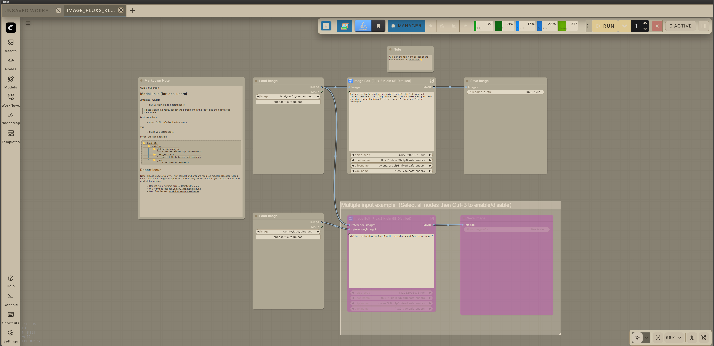

# Nier Automata ComfyUI Theme

## Description :art:
A ComfyUI theme inspired by the game *NieR:Automata*.

## Screenshot :camera:

## Files :file_folder:
- `user.css` — main theme file
- `nier-automata.json` — color palette preset
- `nier_automata_comfyui_bg_clean_arcs.png` — optional background image

## Download :arrow_down:
Option 1 (ZIP):
1. Click **Code ? Download ZIP** on GitHub.
2. Extract the ZIP.

Option 2 (git):
1. `git clone https://github.com/Flibens/nier-automata-comfyui-theme`

## Install / Use :wrench:
1. Copy `user.css` to `ComfyUI/user/default/user.css`.
2. In ComfyUI, go to **Settings ? Appearance ? Color Palette** and import `nier-automata.json`.
3. In **Settings ? Appearance ? Canvas Background Image**, upload `nier_automata_comfyui_bg_clean_arcs.png`.
4. You can swap the background image for your own if you prefer.

## Compatibility :warning:
- Not tested on ComfyUI Nodes 2.0.
- Tested on ComfyUI v0.3.76 and newer.

## Recommendation :bulb:
Install the [ComfyUI Custom Node Color](https://github.com/lovelybbq/comfyui-custom-node-color) custom node to customize group colors so they are easier to see.

## Notes :memo:
This theme is a fan project and not affiliated with Square Enix.

